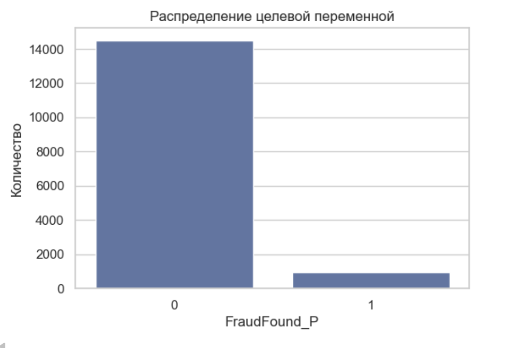
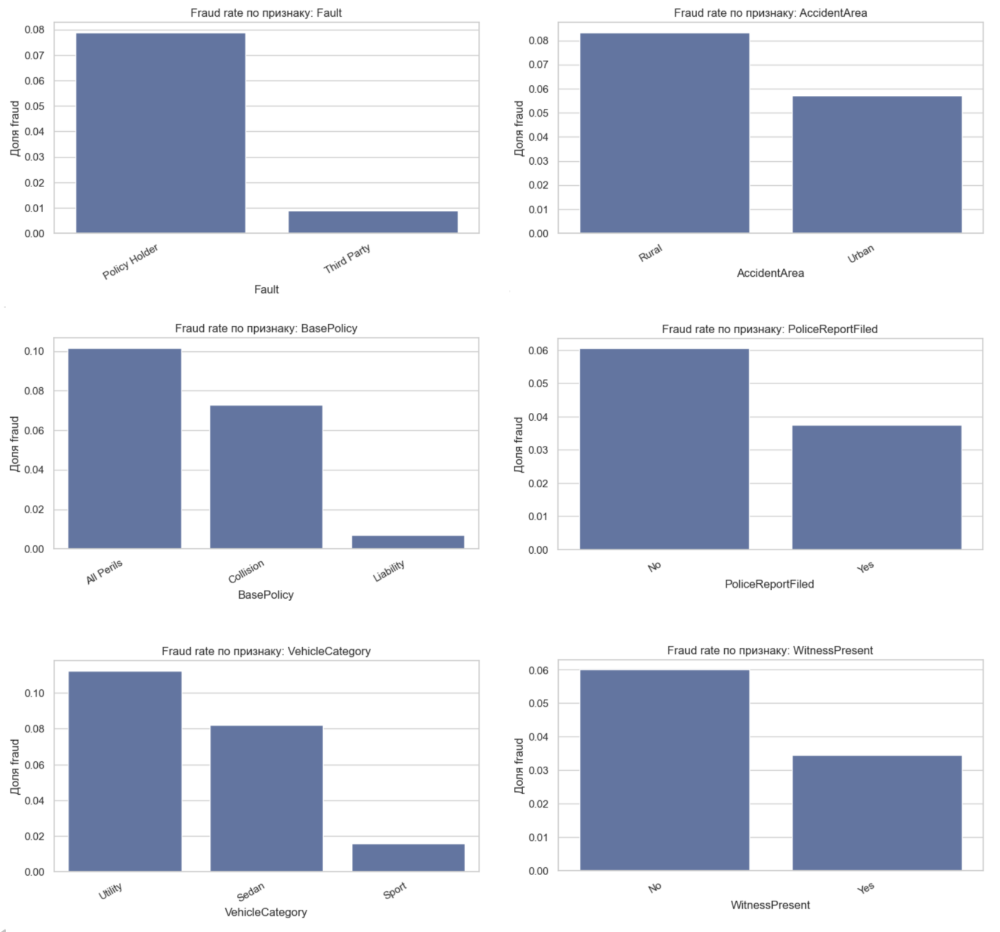
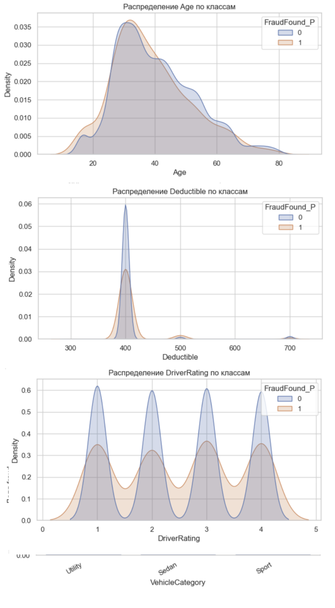
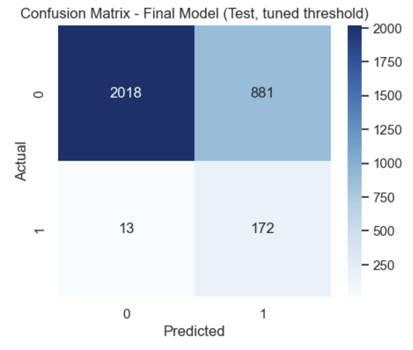
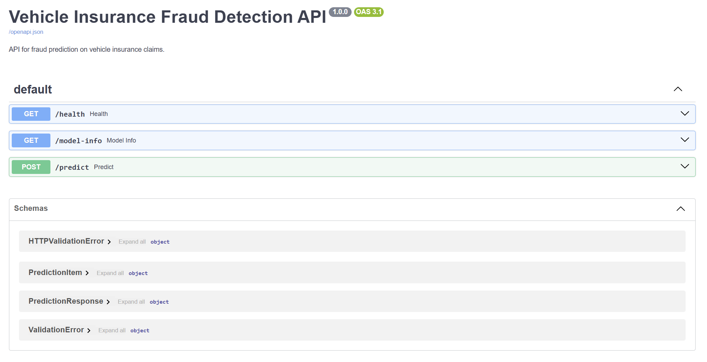
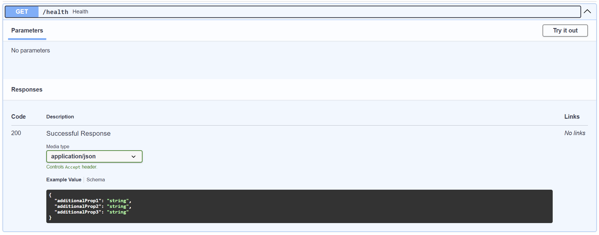
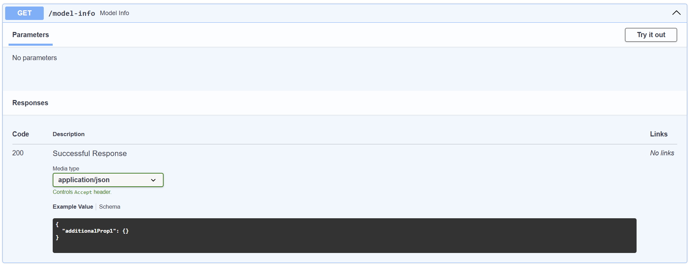
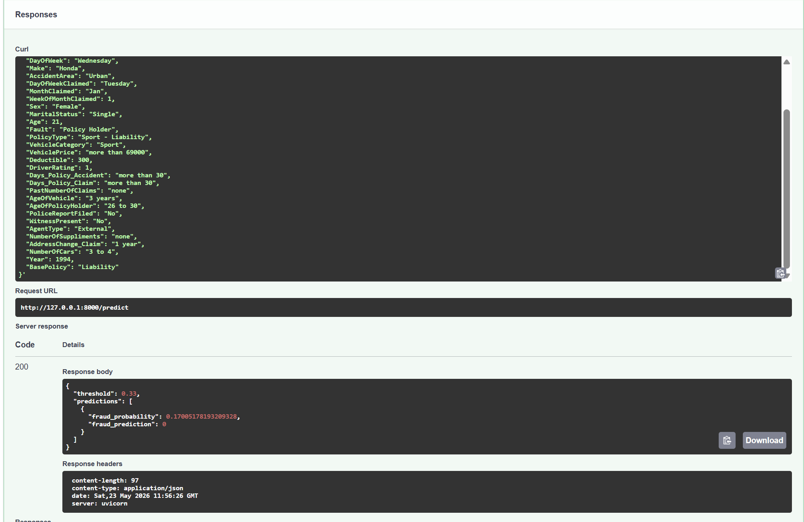
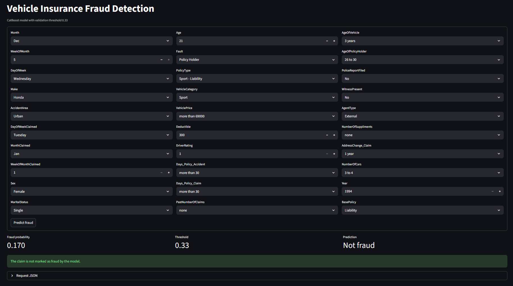

# Отчёт по проекту

**Студент:** Алексеев Владислав Алексеевич  
**Группа:** БИВ232

---

## 1. Введение и постановка задачи

Задача проекта - предсказать, является ли страховая заявка по автомобилю мошеннической. Целевая переменная: FraudFound_P, где 1 означает fraud, 0 - обычная заявка.

Основная метрика - PR-AUC. Я выбрал ее, потому что fraud-класс редкий. в данных 923 fraud-случая из 15420 строк, то есть около 6%. В такой задаче обычная accuracy может быть высокой даже у модели, которая почти не находит fraud. Дополнительно смотрел на Recall, F1, Balanced Accuracy и ROC-AUC.

---

## 2. Поиск и описание данных

Датасет: Vehicle Insurance Claim Fraud Detection с Kaggle:  
https://www.kaggle.com/datasets/shivamb/vehicle-claim-fraud-detection/data

Файл в проекте: data/raw/fraud_oracle.csv.

Размер исходных данных: 15420 строк и 33 столбца.

В данных есть:

- признаки даты и времени: месяц, день недели, неделя месяца
- признаки клиента и полиса: возраст, пол, семейное положение, тип полиса
- признаки автомобиля: марка, возраст, цена, категория
- признаки заявки: наличие свидетеля, полицейский отчет, виновник, количество прошлых заявок
- целевая переменная FraudFound_P.

Данные подходят для проекта, потому что это реальная табличная задача со смешанными числовыми и категориальными признаками и заметным дисбалансом классов.

---

## 3. Обработка и подготовка данных

Очистка делалась в notebooks/01_eda.ipynb и вынесена в src/preprocessing.py.

Что было сделано:

- удалил PolicyNumber и RepNumber, потому что это идентификаторы, а не полезные признаки;
- удалил строку с некорректным MonthClaimed = 0;
- заменил Age = 0 на 16.5 в группе от 16 до 17 лет, так как нулевой возраст невозможен;
- удалил дубликаты;
- сохранил обработанные данные в data/processed/.

После очистки получилось 15419 строк и 31 столбец. После feature engineering - 15419 строк и 37 столбцов.

Добавленные признаки:

- HasPoliceReport - был ли полицейский отчет;
- HasWitness - был ли свидетель;
- IsUrban - городская ли зона аварии;
- Age_ClaimGap - комбинация возраста авто и возраста владельца полиса;
- Policy_Claim_Month_Same - совпадает ли месяц полиса и заявки;
- WeekendLikeClaim - была ли заявка в выходной день.

Разбиение данных: train / validation / test = 60% / 20% / 20%. Разбиение стратифицированное по FraudFound_P, чтобы сохранить долю fraud во всех частях. Препроцессинг обучался внутри pipeline только на train, чтобы не было data leakage.



Распределение целевой переменной FraudFound_P. Видно, что fraud-класс сильно меньше основного класса.



Доля fraud по ключевым категориальным признакам.



Распределения числовых признаков отдельно для обычных и fraud-заявок.

---

## 4. Baseline-модель

В качестве Baseline я взял сразу несколько моделей: DummyClassifier, LogisticRegression, LinearSVC, KNN, DecisionTree.

Лучше всего среди baseline показали себя LogisticRegression и LinearSVC с class_weight='balanced'. Они хорошо находят fraud по recall, но дают много ложных срабатываний.

| Модель | Признаки | Accuracy | Balanced Accuracy | Precision | Recall | F1 | ROC-AUC | PR-AUC |
|---|---|---:|---:|---:|---:|---:|---:|---:|
| LogisticRegression | raw | 0.6641 | 0.7353 | 0.1310 | 0.8162 | 0.2257 | 0.7974 | 0.1566 |
| LinearSVC | raw | 0.6508 | 0.7510 | 0.1320 | 0.8649 | 0.2291 | 0.7884 | 0.1560 |
| LogisticRegression | FE | 0.6845 | 0.7427 | 0.1390 | 0.8000 | 0.2374 | 0.8002 | 0.1600 |
| LinearSVC | FE | 0.6488 | 0.7505 | 0.1319 | 0.8649 | 0.2289 | 0.7928 | 0.1594 |

Baseline уже умела находить fraud, но качество ранжирования низкое (PR-AUC около 0.16).
---

## 5. Эксперименты

### Эксперимент 1. Более сильные модели и ансамбли

**Гипотеза:** градиентные бустинги и ансамбли лучше работают с табличными данными, чем простые baseline-модели.

**Как проверялось:** обучил RandomForest, XGBoost, LightGBM, CatBoost, а также оставил линейные модели для сравнения. Метрики считались на validation.

**Результат:** по PR-AUC лучше всего сработали бустинги.

| Модель | PR-AUC | ROC-AUC | F1 | Комментарий |
|---|---:|---:|---:|---|
| XGBoost | 0.2479 | - | - | лучший PR-AUC, но низкий recall при стандартном пороге |
| LightGBM | 0.2427 | 0.8357 | 0.2612 | хороший баланс метрик |
| CatBoost | 0.2147 | 0.8427 | 0.2716 | recall и F1 лучше, чем у части моделей |
| RandomForest | 0.1979 | 0.8186 | 0.2412 | хуже бустингов по PR-AUC |
| LogisticRegression | 0.1624 | 0.8041 | 0.2392 | близко к baseline |
| LinearSVC | 0.1619 | 0.7966 | 0.2325 | близко к baseline |

### Эксперимент 2. Подбор гиперпараметров

**Гипотеза:** тюнинг улучшит качество сильных моделей.

**Как проверялось:** использовал GridSearchCV со стратифицированной кросс-валидацией. Подбирал параметры для LogisticRegression, RandomForest, LightGBM, CatBoost. Основная метрика подбора - average_precision, то есть PR-AUC.

**Результат:** лучший PR-AUC у tuned LightGBM, но он почти не предсказывал fraud при стандартном пороге. CatBoost был чуть ниже по PR-AUC, зато гораздо лучше по recall и F1.

| Модель | PR-AUC | Precision | Recall | F1 | Вывод |
|---|---:|---:|---:|---:|---|
| tuned LightGBM | 0.2486 | 1.0000 | 0.0324 | 0.0628 | хорошо ранжирует, но почти не ловит fraud |
| tuned CatBoost | 0.2466 | 0.1809 | 0.6432 | 0.2823 | лучший практический баланс |
| tuned RandomForest | 0.2454 | 0.0000 | 0.0000 | 0.0000 | при стандартном пороге не нашел fraud |
| tuned LogisticRegression | 0.1715 | 0.0000 | 0.0000 | 0.0000 | слабее бустингов |

### Эксперимент 3. Уменьшение размерности

**Гипотеза:** после one-hot encoding признаков становится много, поэтому TruncatedSVD может убрать шум.

**Как проверялось:** проверил модели после TruncatedSVD с разным числом компонент.

**Результат:** лучший вариант после SVD дал PR-AUC = 0.1946, что хуже лидеров без SVD. Поэтому SVD не использовался в финальной модели.

| Подход | Лучший результат | Вывод |
|---|---:|---|
| TruncatedSVD + модели | PR-AUC = 0.1946 | хуже бустингов на исходных FE-признаках |

### Эксперимент 4. Подбор threshold

**Гипотеза:** стандартный порог 0.5 не подходит для fraud detection, потому что важнее не пропустить fraud.

**Как проверялось:** для лучших моделей перебрал threshold на validation и сравнил precision, recall и F1.

**Результат:** лучший вариант - tuned CatBoost с threshold 0.33.

| Модель | Threshold | PR-AUC | Precision | Recall | F1 | Вывод |
|---|---:|---:|---:|---:|---:|---|
| tuned CatBoost | 0.33 | 0.2466 | 0.1626 | 0.8595 | 0.2734 | выбран финально |
| tuned LightGBM | 0.09 | 0.2486 | - | 0.7892 | ниже CatBoost | хуже по F1 |

---

## 6. Финальная модель и интерпретируемость

Финальная модель - tuned CatBoost на FE-признаках с threshold 0.33. После выбора модели она была дообучена на train + validation и проверена на test.

| Модель | Accuracy | Balanced Accuracy | Precision | Recall | F1 | ROC-AUC | PR-AUC |
|---|---:|---:|---:|---:|---:|---:|---:|
| tuned CatBoost, threshold 0.33 | 0.7101 | 0.8129 | 0.1633 | 0.9297 | 0.2779 | 0.8680 | 0.2647 |

Confusion matrix на test:

|  | Pred 0 | Pred 1 |
|---|---:|---:|
| True 0 | 2018 | 881 |
| True 1 | 13 | 172 |



Confusion matrix финальной модели на test.

Модель нашла 172 fraud-случая из 185 и пропустила 13. Главный минус - 881 ложное срабатывание, что ожидаемо, так как я выбрал высокий recall, чтобы реже пропускать мошенничество.

Так, результат можно использовать как подсказку для бизнеса, но не как доказательство fraud. Финальное решение должно быть сигналом для дополнительной проверки, а не автоматическим отказом клиенту.

---

## 7. Деплой

Для отправки запросов реализован локальный API на FastAPI. Также добавлен Streamlit-интерфейс, чтобы можно было проверить заявку через форму, без ручного JSON.

Запуск FastAPI:

```bash
python -m uvicorn src.api:app --reload
```

Эндпоинты:

- `GET /health` - проверка, что сервис работает;
- `GET /model-info` - информация о модели и threshold;
- `POST /predict` - прогноз fraud по JSON с признаками заявки.

Запуск Streamlit:

```bash
python -m streamlit run src/streamlit_app.py
```

В Streamlit можно выбрать значения признаков страховой заявки и нажать `Predict fraud`. Интерфейс показывает вероятность fraud, threshold `0.33` и итоговый класс.

Пример ответа `/predict`:

```json
{
  "threshold": 0.33,
  "predictions": [
    {
      "fraud_probability": 0.12,
      "fraud_prediction": 0
    }
  ]
}
```
Скрины работы: 



Swagger UI. список эндпоинтов FastAPI.

---



Документация эндпоинта GET /health.

---



Документация эндпоинта GET /model-info.

---



Успешный запрос POST /predict через Swagger UI.

---



Streamlit-интерфейс.

Видео работы: 

https://disk.yandex.ru/i/dZZ07LMQDKyCkQ

---

## 8. Заключение и выводы

В ходе проекта я нашел данные, сделал очистку, EDA, baseline, feature engineering, сравнил несколько моделей, подобрал гиперпараметры и threshold, затем добавил FastAPI и Streamlit для проверки модели.

Baseline давал PR-AUC около 0.16. Финальная модель получила PR-AUC = 0.2647 и Recall = 0.9297 на test. Это лучше подходит для fraud detection, потому что модель находит большинство мошеннических заявок.

Однако, в результате получилась низкая precision и много false positive. Тут можно изменить threshold, в зависимости от цели. Если ложные проверки дорогие, threshold стоит поднять. Если важнее не пропускать fraud, можно оставить более низкий threshold.
